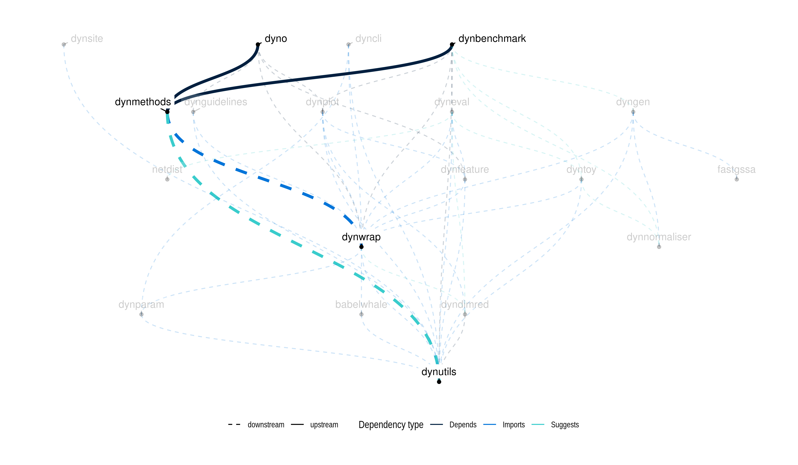

<!-- README.md is generated from README.Rmd. Please edit that file -->

[**ℹ️ Tutorials**](https://dynverse.org)     [**ℹ️ Reference
documentation**](https://dynverse.org/reference/dynmethods)
 

# A collection of 55 trajectory inference methods

This package contains wrappers for trajectory inference (TI) methods.
The output of each method is transformed into a common trajectory model
using [dynwrap](https://www.github.com/dynverse/dynwrap), which allows
easy [visualisation and
comparison](https://www.github.com/dynverse/dyno). All methods are
wrapped inside a docker container, which avoids dependency issues, and
also makes it easy to add a new method.

**To run any of these methods, interpret the results and visualise the
trajectory, see the [dyno
package](https://www.github.com/dynverse/dyno).**

To include your own method, feel free to send us a [pull
request](https://github.com/dynverse/dynmethods/pulls) or create an
[issue](https://github.com/dynverse/dynmethods/labels/new%20method). The
easiest way to add a new method is [through a docker
container](https://dynverse.github.io/dynwrap/articles/create_ti_method_docker.html),
so that dependencies don’t pose any issues for other users, but we also
welcome methods [directly wrapped inside of
R](https://dynverse.github.io/dynwrap/articles/create_ti_method_r.html).
The main benefit of adding your own method is that users can easily
compare your method with others and [visualise/interpret the
output](https://www.github.com/dynverse/dyno). Moreover, your method
will be compared to other methods within [the TI method
evaluation](https://doi.org/10.1101/276907).

## List of included methods

| Method              | Doi                                                                                                             | Code                                                       | Docker                                                                                                                                     | Status                                                                                                                                            | Authors                                                                                                                                                                                                                                                                                                                                                                                                                                                                                                                                                                                  |
| :------------------ | :-------------------------------------------------------------------------------------------------------------- | :--------------------------------------------------------- | :----------------------------------------------------------------------------------------------------------------------------------------- | :------------------------------------------------------------------------------------------------------------------------------------------------ | :--------------------------------------------------------------------------------------------------------------------------------------------------------------------------------------------------------------------------------------------------------------------------------------------------------------------------------------------------------------------------------------------------------------------------------------------------------------------------------------------------------------------------------------------------------------------------------------- |
| Angle               |                                                                                                                 | [code](https://github.com/dynverse/ti_angle)               |                |                              |                                                                                                                                                                                                                                                                                                                                                                                                                                                                                                                                                                                          |
| CALISTA             |                    | [code](https://github.com/dynverse/ti_calista)             |              |                          | Nan Papili Gao                                                                                                                                                                                                                                                                                                                                                                                                                                                                       |
| CellRouter          |        | [code](https://github.com/dynverse/ti_cellrouter)          |           |                    | Edroaldo Lummertz da Rocha   James J. Collins  George Q. Daley                                                                                                                                                                           |
| CellTrails          |      | [code](https://github.com/dynverse/ti_celltrails)          |           |                    | Daniel Ellwanger                                                                                                                                                                                                                                                                                                                                                                                                                                                              |
| cellTree Gibbs      |         | [code](https://github.com/dynverse/ti_celltree_gibbs)      |       |            | David duVerle   Koji Tsuda                                                                                                                           |
| cellTree maptpx     |         | [code](https://github.com/dynverse/ti_celltree_maptpx)     |      |          | David duVerle   Koji Tsuda                                                                                                                           |
| cellTree vem        |         | [code](https://github.com/dynverse/ti_celltree_vem)        |         |                | David duVerle   Koji Tsuda                                                                                                                           |
| Component 1         |                                                                                                                 | [code](https://github.com/dynverse/ti_comp1)               |                |                              |                                                                                                                                                                                                                                                                                                                                                                                                                                                                                                                                                                                          |
| DPT                 |                | [code](https://github.com/dynverse/ti_dpt)                 |                  |                                  | Laleh Haghverdi Philipp Angerer   Fabian Theis                                                                                          |
| ElPiGraph           |                                                                                                                 | [code](https://github.com/dynverse/ti_elpigraph)           |            |                      | Luca Albergante                                                                                                                                                                                                                                                                                                                                                             |
| ElPiGraph - Cycle   |                                                                                                                 | [code](https://github.com/dynverse/ti_elpicycle)           |            |                      | Luca Albergante                                                                                                                                                                                                                                                                                                                                                             |
| ElPiGraph - Linear  |                                                                                                                 | [code](https://github.com/dynverse/ti_elpilinear)          |           |                    | Luca Albergante                                                                                                                                                                                                                                                                                                                                                             |
| Embeddr             |                    | [code](https://github.com/dynverse/ti_embeddr)             |              |                          | Kieran Campbell                                                                                                                                                                                                                                                                                                                                                                                                                                                           |
| FateID              |                | [code](https://github.com/dynverse/ti_fateid)              |               |                            | Dominic Grün                                                                                                                                                                                                                                                                                                                                                                                                                                                                        |
| FORKS               |                    | [code](https://github.com/dynverse/ti_forks)               |                |                              | Mayank Sharma                                                                                                                                                                                                                                                                                                                                                                                                                                                                   |
| GNG                 |                                                                                                                 | [code](https://github.com/dynverse/ti_gng)                 |                  |                                  | Robrecht Cannoodt                                                                                                                                                                                                                                                                                                                                                          |
| GPfates             |        | [code](https://github.com/dynverse/ti_gpfates)             |              |                          | Valentine Svensson   Sarah A. Teichmann                                                                                                                       |
| GrandPrix           |                    | [code](https://github.com/dynverse/ti_grandprix)           |            |                      | Sumon Ahmed                                                                                                                                                                                                                                                                                                                                                                                                                                                                 |
| MATCHER             |         | [code](https://github.com/dynverse/ti_matcher)             |              |                          | Joshua Welch  Jan Prins                                                                                                                                                                                                                                                                                                                                                                                                                                            |
| MERLoT              |                    | [code](https://github.com/dynverse/ti_merlot)              |               |                            | Gonzalo Parra   Johannes Söding                                                                                                                       |
| MFA                 |  | [code](https://github.com/dynverse/ti_mfa)                 |                  |                                  | Kieran Campbell  Christopher Yau                                                                                                                                                                                                                                                                                                                      |
| Monocle DDRTree     |                | [code](https://github.com/dynverse/ti_monocle_ddrtree)     |      |          | Xiaojie Qiu  Cole Trapnell                                                                                                                                                                                                                                   |
| Monocle ICA         |                | [code](https://github.com/dynverse/ti_monocle_ica)         |          |                  | Xiaojie Qiu  Cole Trapnell                                                                                                                                                                                                                                   |
| Mpath               |               | [code](https://github.com/dynverse/ti_mpath)               |                |                              | Michael Poidinger  Jinmiao Chen                                                                                                                                                                                                                     |
| MST                 |                                                                                                                 | [code](https://github.com/dynverse/ti_mst)                 |                  |                                  |                                                                                                                                                                                                                                                                                                                                                                                                                                                                                                                                                                                          |
| ouija               |                    | [code](https://github.com/dynverse/ti_ouija)               |                |                              | Kieran Campbell  Christopher Yau                                                                                                                                                                                                                                                                                                                      |
| ouijaflow           |                    | [code](https://github.com/dynverse/ti_ouijaflow)           |            |                      | Kieran Campbell  Christopher Yau                                                                                                                                                                                                                                                                                                                                                                                                                            |
| PAGA                |         | [code](https://github.com/dynverse/ti_paga)                |                 |                                | Alexander Wolf   Fabian Theis                                                                                                                                                                                                                                  |
| PAGA Tree           |         | [code](https://github.com/dynverse/ti_paga_tree)           |            |                      | Alexander Wolf   Fabian Theis                                                                                                                                                                                                                                  |
| pCreode             |        | [code](https://github.com/dynverse/ti_pcreode)             |              |                          | Charles A. Herring  Ken S. Lau                                                                                                                                                                                                                                                                                                                                       |
| Periodic PrinCurve  |                                                                                                                 | [code](https://github.com/dynverse/ti_periodpc)            |             |                        |                                                                                                                                                                                                                                                                                                                                                                                                                                                                                                                                                                                          |
| PhenoPath           |                    | [code](https://github.com/dynverse/ti_phenopath)           |            |                      | Kieran Campbell  Christopher Yau                                                                                                                                                                                                                                                                                                                      |
| Projected DPT       |                                                                                                                 | [code](https://github.com/dynverse/ti_projected_dpt)       |        |              |                                                                                                                                                                                                                                                                                                                                                                                                                                                                                                                                                                                          |
| Projected Monocle   |                                                                                                                 | [code](https://github.com/dynverse/ti_projected_monocle)   |    |      |                                                                                                                                                                                                                                                                                                                                                                                                                                                                                                                                                                                          |
| Projected PAGA      |                    | [code](https://github.com/dynverse/ti_projected_paga)      |       |            |                                                                                                                                                                                                                                                                                                                                                                                                                                                                                                                                                                                          |
| Projected Slingshot |         | [code](https://github.com/dynverse/ti_projected_slingshot) |  |  |                                                                                                                                                                                                                                                                                                                                                                                                                                                                                                                                                                                          |
| Projected TSCAN     |                                                                                                                 | [code](https://github.com/dynverse/ti_projected_tscan)     |      |          |                                                                                                                                                                                                                                                                                                                                                                                                                                                                                                                                                                                          |
| pseudogp            |      | [code](https://github.com/dynverse/ti_pseudogp)            |             |                        | Kieran Campbell  Christopher Yau                                                                                                                                                                                                                                                                                                                      |
| RaceID / StemID     |        | [code](https://github.com/dynverse/ti_raceid_stemid)       |        |              | Dominic Grün  Alexander van Oudenaarden                                                                                                                                                                                                                                                                                                                                    |
| reCAT               |        | [code](https://github.com/dynverse/ti_recat)               |                |                              | Riu Jian                                                                                                                                                                                                                                                                                                                                                                                                                                                                        |
| SCIMITAR            |        | [code](https://github.com/dynverse/ti_scimitar)            |             |                        | Josh Stuart                                                                                                                                                                                                                                                                                                                                                                                                                                                                   |
| SCORPIUS            |                    | [code](https://github.com/dynverse/ti_scorpius)            |             |                        | Robrecht Cannoodt   Wouter Saelens   Yvan Saeys  |
| SCOUP               |         | [code](https://github.com/dynverse/ti_scoup)               |                |                              | Hirotaka Matsumoto                                                                                                                                                                                                                                                                                                                                                                                                                                                             |
| SCUBA               |           | [code](https://github.com/dynverse/ti_scuba)               |                |                              | Eugenio Marco  Gregory Giecold  Guo-Cheng Yuan                                                                                                     |
| Sincell             |     | [code](https://github.com/dynverse/ti_sincell)             |              |                          | Antonio Rausell  Miguel Julia                                                                                                                                                                                                                                                                                                                                                                                                                                      |
| SLICE               |               | [code](https://github.com/dynverse/ti_slice)               |                |                              | Yan Xu  Minzhe Guo                                                                                                                                                                                                                                                                                                                                                     |
| SLICER              |         | [code](https://github.com/dynverse/ti_slicer)              |               |                            | Joshua Welch  Jan Prins                                                                                                                                                                                                                                                                                                                                                                                                                                            |
| Slingshot           |         | [code](https://github.com/dynverse/ti_slingshot)           | [-blue.svg?logo=docker)](https://hub.docker.com/r/dynverse/ti_slingshot)   |                      | Kelly Street  Sandrine Dudoit                                                                                                                                                                                                                            |
| STEMNET             |                   | [code](https://github.com/dynverse/ti_stemnet)             |              |                          | Lars Velten                                                                                                                                                                                                                                                                                                                                                                                                                                                             |
| topslam             |                    | [code](https://github.com/dynverse/ti_topslam)             |              |                          | Max Zwiessele                                                                                                                                                                                                                                                                                                                                                                                                                                                                  |
| TSCAN               |                | [code](https://github.com/dynverse/ti_tscan)               |                |                              | Zhicheng Ji  Hongkai Ji                                                                                                                                                                                                                                                                                                                                                                                                                                               |
| URD                 |           | [code](https://github.com/dynverse/ti_urd)                 |                  |                                  | Jeffrey A. Farrell                                                                                                                                                                                                                                                                                                                                                                                                                                                              |
| Wanderlust          |        | [code](https://github.com/dynverse/ti_wanderlust)          |           |                    | Manu Setty  Dana Pe’er                                                                                                                                                                                                                                                                                                                                      |
| Waterfall           |        | [code](https://github.com/dynverse/ti_waterfall)           |            |                      | Jaehoon Shin Hongjun Song                                                                                                                                                                                                                                                                                                                                                                                                                                                                                                                                       |
| Wishbone            |                  | [code](https://github.com/dynverse/ti_wishbone)            |             |                        | Manu Setty  Dana Pe’er                                                                                                                                                                                                                                                                                                                                      |

## Sources

We used following resources to get a (hopefully exhaustive) list of all
TI methods:

[Anthony Gitter’s
single-cell-pseudotime](https://github.com/agitter/single-cell-pseudotime)

[Sean Davis’
awesome-single-cell](https://github.com/seandavi/awesome-single-cell)

[Luke Zappia’s scRNA-tools](https://www.scrna-tools.org)

## New methods

Some methods are not wrapped (yet). Check out the
[issues](https://github.com/dynverse/dynmethods/issues?q=is%3Aissue+is%3Aopen+sort%3Aupdated-desc+label%3Anew_method)
for an overview

## Latest changes

Check out `news(package = "dynwrap")` or [NEWS.md](NEWS.md) for a
full list of
changes.

<!-- This section gets automatically generated from inst/NEWS.md, and also generates inst/NEWS -->

### Recent changes in dynmethods 1.1.0 (unreleased)

  - MAJOR CHANGE: Add functionality to switch between R wrappers and
    container wrappers

  - MAJOR CHANGE: Add R wrappers for **SCORPIUS**

### Recent changes in dynmethods 1.0.5 (03-07-2019)

  - SMALL CHANGES: Updates for scorpius, slingshot, paga, paga\_tree and
    paga\_projected

## Dynverse dependencies

<!-- Generated by "update_dependency_graphs.R" in the main dynverse repo -->

