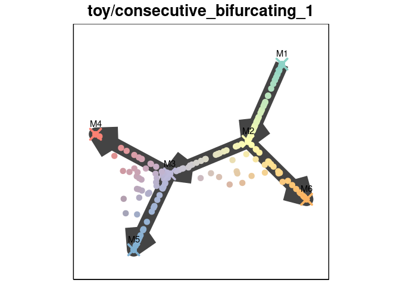
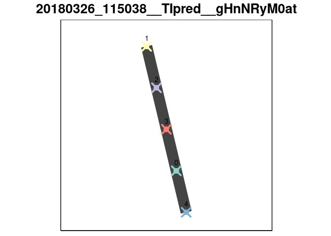
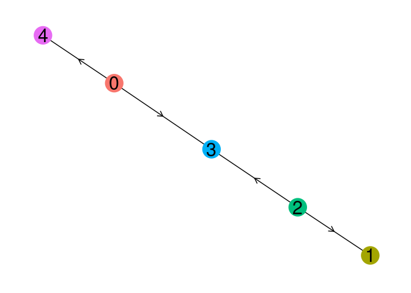
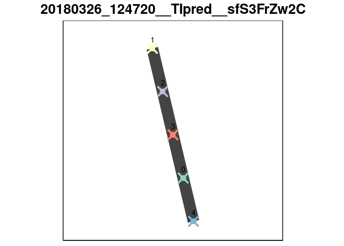
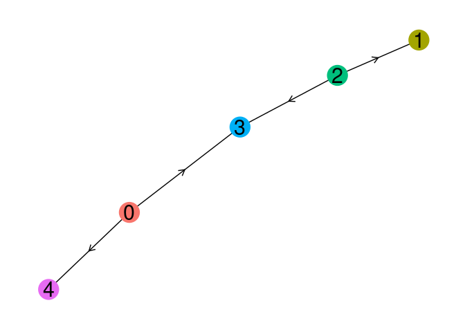

AGA
================
2018-03-26

This document serves to provide insight into how a trajectory inference method was used and wrapped. Feel free to discuss implementation-specific details by [creating an issue](https://github.com/dynverse/dynmethods/issues) on GitHub, or improve the wrapper and create a pull request.

``` r
library(tidyverse)
library(dynmethods)
library(dynwrap)
library(dynutils)
library(dynplot)
```

Description
===========

AGA is a trajectory inference method implemented in the [Scanpy](https://scanpy.readthedocs.io/en/latest/) package. The core algorithms used are k-nearest-neighbours for representing cells as a graph, louvain clustering for grouping cells into milestones, and connectivity testing for identifying transitions between the milestones. The wrapper can be accessed using the `description_aga` function.

``` r
method <- description_aga()
```

This description contains information on which packages need to have been installed in order to run the method and what are the parameters.

``` r
str(method, max.level = 1)
```

    ## List of 8
    ##  $ name            : chr "AGA"
    ##  $ short_name      : chr "aga"
    ##  $ package_loaded  : NULL
    ##  $ package_required: chr [1:2] "aga" "igraph"
    ##  $ par_set         :List of 2
    ##   ..- attr(*, "class")= chr "ParamSet"
    ##  $ properties      : NULL
    ##  $ run_fun         :function (expression, grouping_assignment = NULL, n_neighbours = 30L, 
    ##     n_pcs = 50L, n_dcs = 10L, resolution = 1, tree_based_confidence = TRUE, 
    ##     verbose = FALSE, num_cores = 1)  
    ##  $ plot_fun        :function (prediction)  
    ##   ..- attr(*, "srcref")=Class 'srcref'  atomic [1:8] 213 13 246 1 13 1 298 331
    ##   .. .. ..- attr(*, "srcfile")=Classes 'srcfilealias', 'srcfile' <environment: 0xec24cb8> 
    ##  - attr(*, "class")= chr [1:2] "dynmethod::description" "list"

``` r
method$par_set
```

    ##                          Type len  Def    Constr Req Tunable Trafo
    ## n_neighbours          integer   -   30  1 to 100   -    TRUE     -
    ## n_pcs                 integer   -   50  0 to 100   -    TRUE     -
    ## n_dcs                 integer   -   10   2 to 50   -    TRUE     -
    ## resolution            numeric   -    1 0.1 to 10   -    TRUE     -
    ## tree_based_confidence logical   - TRUE         -   -    TRUE     -

Example
=======

First we retrieve a toy dataset from [http://github.com/dynverse/dyntoy](dyntoy).

``` r
toy_tasks <- dyntoy::toy_tasks %>% 
  filter(model == "consecutive_bifurcating") %>% 
  slice(1)
toy_task <- toy_tasks %>% extract_row_to_list(1)

plot_default(toy_task)
```



We extract the default parameters from the method.

``` r
defprm <- get_default_parameters(method)
```

Applying AGA on the toy dataset can be performed using the `execute_method` function.

``` r
out <- execute_method(toy_tasks, method, parameters = defprm)[[1]]
```

    ## Parsed with column specification:
    ## cols(
    ##   cell_id = col_character(),
    ##   X_diffmap0 = col_double(),
    ##   louvain_groups = col_integer(),
    ##   group_id = col_integer()
    ## )

The output will consist of a summary and the model. The summary will contain information pertaining the execution of the method, while the model will contain the trajectory inferred by the method.

``` r
out$summary %>% knitr::kable()
```

| method\_name | method\_short\_name | task\_id                        |  time\_sessionsetup|  time\_preprocessing|  time\_method|  time\_postprocessing|  time\_wrapping|  time\_sessioncleanup| error |  num\_files\_created|  num\_setseed\_calls| prior\_df                                                   |
|:-------------|:--------------------|:--------------------------------|-------------------:|--------------------:|-------------:|---------------------:|---------------:|---------------------:|:------|--------------------:|--------------------:|:------------------------------------------------------------|
| AGA          | aga                 | toy/consecutive\_bifurcating\_1 |           0.0130212|             8.65e-05|       1.43611|             0.2281947|       0.0001907|             0.0005667| NULL  |                    0|                    0| list(prior\_type = logical(0), prior\_names = character(0)) |

``` r
model <- out$model 

plot_default(model)
```



``` r
plot_trajectory(model, method)
```

    ## Loading required namespace: ggraph

    ## Loading required namespace: tidygraph



Wrapper implementation
======================

This section will detail the specific wrapper implementation by applying it on the toy dataset, and should follow the same implementation structure as the [https://github.com/dynverse/dynmethods/blob/master/R/ti\_aga.R](source%20code).

Since AGA is implemented in Python, we created an R package for it, available at [github.com/dynverse/aga](https://github.com/dynverse/aga). The R package will write the expression values and any parameters to a file, execute a python script, and read the results from output files produced by AGA.

``` r
expression <- toy_task$expression
aga_out <- aga::aga(
  expression = expression,
  start_cell = NULL,
  grouping_assignment = NULL,
  n_neighbours = defprm$n_neighbours,
  n_pcs = defprm$n_pcs,
  n_dcs = defprm$n_dcs,
  resolution = defprm$resolution,
  tree_based_confidence = defprm$tree_based_confidence,
  verbose = FALSE,
  num_cores = 1
)
```

    ## Parsed with column specification:
    ## cols(
    ##   cell_id = col_character(),
    ##   X_diffmap0 = col_double(),
    ##   louvain_groups = col_integer(),
    ##   group_id = col_integer()
    ## )

After building a kNN graph, the kNN graph is clustered into louvain groups:

``` r
aga_out$obs %>% head(6) %>% knitr::kable()
```

| cell\_id |  X\_diffmap0|  louvain\_groups| group\_id |
|:---------|------------:|----------------:|:----------|
| C1       |    0.0733178|                3| 3         |
| C2       |    0.0729600|                3| 3         |
| C3       |    0.0701184|                2| 2         |
| C4       |    0.0731877|                3| 3         |
| C5       |    0.0684289|                1| 1         |
| C6       |    0.0683206|                1| 1         |

``` r
milestone_assignment_cells <- setNames(aga_out$obs$group_id, aga_out$obs$cell_id)
```

Several tests are used to assess which transitions exist between the louvain groups. We use the `aga_adjacency_tree_confidence` to construct the milestone network.

``` r
aga_out$adj %>% head(6) %>% knitr::kable()
```

| from | to  |  aga\_adjacency\_tree\_confidence|  aga\_adjacency\_full\_confidence|  aga\_adjacency\_full\_attachedness|
|:-----|:----|---------------------------------:|---------------------------------:|-----------------------------------:|
| 0    | 0   |                                 0|                         0.0000000|                                   0|
| 1    | 0   |                                 0|                         0.0000000|                                   0|
| 2    | 0   |                                 0|                         0.0000000|                                   0|
| 3    | 0   |                                 0|                         0.2819045|                                  28|
| 4    | 0   |                                 0|                         1.0000000|                                 213|
| 0    | 1   |                                 0|                         0.0000000|                                   0|

``` r
milestone_network <- aga_out$adj %>%
  mutate_at(vars(from, to), as.character) %>%
  filter(aga_adjacency_tree_confidence > 0) %>%
  mutate(
    length = 1,
    directed = FALSE
  ) %>%
  select(from, to, length, directed)

milestone_ids <- sort(unique(milestone_assignment_cells))
```

The prediction is wrapped using the `add_cluster_graph` function.

``` r
prediction <- wrap_prediction_model(
  cell_ids = rownames(expression)
) %>% add_cluster_graph(
  milestone_ids = milestone_ids,
  milestone_network = milestone_network,
  milestone_assignment_cells = milestone_assignment_cells,
  aga_out = aga_out
)

plot_default(prediction)
```



``` r
plot_trajectory(model, method)
```



Quality control
===============

TODO

To do's
=======

-   Allow the aga R package to return the dimensionality reductions created by scanpy.
