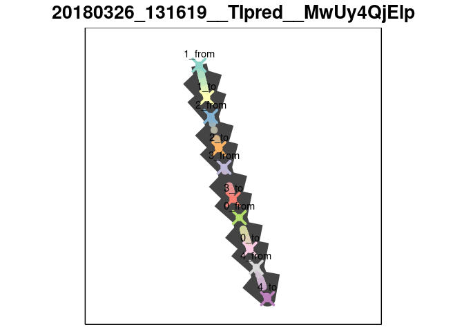
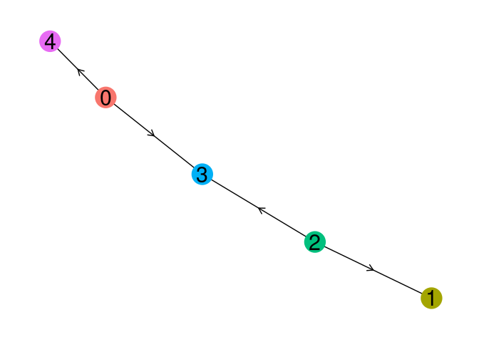
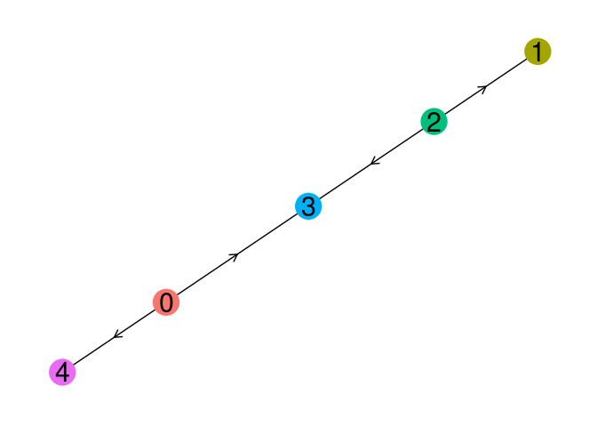

AGA Pseudotime
================
2018-03-26

This document serves to provide insight into how a trajectory inference method was used and wrapped. Feel free to discuss implementation-specific details by [creating an issue](https://github.com/dynverse/dynmethods/issues) on GitHub, or improve the wrapper and create a pull request.

``` r
library(tidyverse)
library(dynmethods)
library(dynwrap)
library(dynutils)
library(dynplot)
```

Description
===========

AGA Pseudotime is similar to the [AGA wrapper](aga.md), except that a start cell has to be given, and the method produces a more refined pseudotemporal ordering of each cell. The core algorithms used are k-nearest-neighbours for representing cells as a graph, louvain clustering for grouping cells into milestones, connectivity testing for identifying transitions between the milestones, and random walks for determining the pseudotemporal ordering of the cells. The wrapper can be accessed using the `description_agapt` function.

``` r
method <- description_agapt()
```

This description contains information on which packages need to have been installed in order to run the method and what are the parameters.

``` r
str(method, max.level = 1)
```

    ## List of 8
    ##  $ name            : chr "AGA pseudotime"
    ##  $ short_name      : chr "agapt"
    ##  $ package_loaded  : NULL
    ##  $ package_required: chr [1:2] "aga" "igraph"
    ##  $ par_set         :List of 2
    ##   ..- attr(*, "class")= chr "ParamSet"
    ##  $ properties      : NULL
    ##  $ run_fun         :function (expression, start_cells, grouping_assignment = NULL, n_neighbours = 30L, 
    ##     n_pcs = 50L, n_dcs = 10L, resolution = 1, tree_based_confidence = TRUE, 
    ##     verbose = FALSE, num_cores = 1)  
    ##  $ plot_fun        :function (prediction)  
    ##   ..- attr(*, "srcref")=Class 'srcref'  atomic [1:8] 213 13 246 1 13 1 298 331
    ##   .. .. ..- attr(*, "srcfile")=Classes 'srcfilealias', 'srcfile' <environment: 0xec24cb8> 
    ##  - attr(*, "class")= chr [1:2] "dynmethod::description" "list"

``` r
method$par_set
```

    ##                          Type len  Def    Constr Req Tunable Trafo
    ## n_neighbours          integer   -   30  1 to 100   -    TRUE     -
    ## n_pcs                 integer   -   50  0 to 100   -    TRUE     -
    ## n_dcs                 integer   -   10   2 to 50   -    TRUE     -
    ## resolution            numeric   -    1 0.1 to 10   -    TRUE     -
    ## tree_based_confidence logical   - TRUE         -   -    TRUE     -

Example
=======

First we retrieve a toy dataset from [http://github.com/dynverse/dyntoy](dyntoy).

``` r
toy_tasks <- dyntoy::toy_tasks %>% 
  filter(model == "consecutive_bifurcating") %>% 
  slice(1)
toy_task <- toy_tasks %>% extract_row_to_list(1)

plot_default(toy_task)
```


We extract the default parameters from the method.

``` r
defprm <- get_default_parameters(method)
```

Applying AGA on the toy dataset can be performed using the `execute_method` function.

``` r
out <- execute_method(toy_tasks, method, parameters = defprm)[[1]]
```

    ## Parsed with column specification:
    ## cols(
    ##   cell_id = col_character(),
    ##   X_diffmap0 = col_double(),
    ##   louvain_groups = col_integer(),
    ##   aga_pseudotime = col_double(),
    ##   group_id = col_integer()
    ## )

The output will consist of a summary and the model. The summary will contain information pertaining the execution of the method, while the model will contain the trajectory inferred by the method.

``` r
out$summary %>% knitr::kable()
```

| method\_name   | method\_short\_name | task\_id                        |  time\_sessionsetup|  time\_preprocessing|  time\_method|  time\_postprocessing|  time\_wrapping|  time\_sessioncleanup| error |  num\_files\_created|  num\_setseed\_calls| prior\_df                                                     |
|:---------------|:--------------------|:--------------------------------|-------------------:|--------------------:|-------------:|---------------------:|---------------:|---------------------:|:------|--------------------:|--------------------:|:--------------------------------------------------------------|
| AGA pseudotime | agapt               | toy/consecutive\_bifurcating\_1 |           0.0110867|             4.94e-05|      1.406051|             0.0937734|       0.0002069|             0.0005894| NULL  |                    0|                    0| list(prior\_type = "required", prior\_names = "start\_cells") |

``` r
model <- out$model 

plot_default(model)
```



``` r
plot_trajectory(model, method)
```



Wrapper implementation
======================

This section will detail the specific wrapper implementation by applying it on the toy dataset, and should follow the same implementation structure as the [https://github.com/dynverse/dynmethods/blob/master/R/ti\_agapt.R](source%20code).

Since AGA is implemented in Python, we created an R package for it, available at [github.com/dynverse/aga](https://github.com/dynverse/aga). The R package will write the expression values and any parameters to a file, execute a python script, and read the results from output files produced by AGA.

``` r
expression <- toy_task$expression

start_cell <- sample(toy_task$prior_information$start_cells, 1)

aga_out <- aga::aga(
  expression = expression,
  start_cell = start_cell,
  grouping_assignment = NULL,
  n_neighbours = defprm$n_neighbours,
  n_pcs = defprm$n_pcs,
  n_dcs = defprm$n_dcs,
  resolution = defprm$resolution,
  tree_based_confidence = defprm$tree_based_confidence,
  verbose = FALSE,
  num_cores = 1
)
```

    ## Parsed with column specification:
    ## cols(
    ##   cell_id = col_character(),
    ##   X_diffmap0 = col_double(),
    ##   louvain_groups = col_integer(),
    ##   aga_pseudotime = col_double(),
    ##   group_id = col_integer()
    ## )

After building a kNN graph, the kNN graph is clustered into louvain groups. Each cluster is considered a separate branch, on which cells are pseudotemporally ordered.

``` r
aga_out$obs %>% head(6) %>% knitr::kable()
```

| cell\_id |  X\_diffmap0|  louvain\_groups|  aga\_pseudotime| group\_id |
|:---------|------------:|----------------:|----------------:|:----------|
| C1       |    0.0733178|                3|        0.3983045| 3         |
| C2       |    0.0729600|                3|        0.3875125| 3         |
| C3       |    0.0701184|                2|        0.1315740| 2         |
| C4       |    0.0731877|                3|        0.3925576| 3         |
| C5       |    0.0684289|                1|        0.0457155| 1         |
| C6       |    0.0683206|                1|        0.0463136| 1         |

Several tests are used to assess which transitions exist between the louvain groups. We use the `aga_adjacency_tree_confidence` to determine how the branches are connected.

``` r
aga_out$adj %>% head(6) %>% knitr::kable()
```

| from | to  |  aga\_adjacency\_tree\_confidence|  aga\_adjacency\_full\_confidence|  aga\_adjacency\_full\_attachedness|
|:-----|:----|---------------------------------:|---------------------------------:|-----------------------------------:|
| 0    | 0   |                                 0|                         0.0000000|                                   0|
| 1    | 0   |                                 0|                         0.0000000|                                   0|
| 2    | 0   |                                 0|                         0.0000000|                                   0|
| 3    | 0   |                                 0|                         0.2819045|                                  28|
| 4    | 0   |                                 0|                         1.0000000|                                 213|
| 0    | 1   |                                 0|                         0.0000000|                                   0|

``` r
branch_network <- aga_out$adj %>%
  mutate_at(vars(from, to), as.character) %>%
  filter(aga_adjacency_tree_confidence > 0) %>%
  select(from, to)
knitr::kable(branch_network)
```

| from | to  |
|:-----|:----|
| 2    | 1   |
| 0    | 3   |
| 2    | 3   |
| 0    | 4   |

We transform the network according to the distance it has from the starting cell.

``` r
# determine order of branches, based on location of root cell
branch_graph <- igraph::graph_from_data_frame(branch_network)
branch_order <- igraph::dfs(
  branch_graph,
  aga_out$obs %>%
    filter(cell_id == start_cell) %>%
    pull(group_id)
)$order %>%
  names()

# now flip order of branch network if from branch is later than to branch
branch_network <- branch_network %>%
  mutate(from_original = from, to_original = to) %>%
  mutate(flip = map2(from, to, ~diff(match(c(.x, .y), branch_order)) < 0)) %>%
  mutate(
    from = ifelse(flip, to_original, from_original),
    to = ifelse(flip, from_original, to_original)
  ) %>%
  select(from, to)
knitr::kable(branch_network)
```

| from | to  |
|:-----|:----|
| 1    | 2   |
| 3    | 0   |
| 2    | 3   |
| 0    | 4   |

Now we create milestone network by giving each branch an edge, and adding a zero-length edge between each branch

``` r
branch_ids <- unique(c(branch_network$from, branch_network$to, aga_out$obs$louvain_groups))

milestone_network <- bind_rows(
  tibble(
    from = paste0(branch_ids, "_from"),
    to = paste0(branch_ids, "_to"),
    length = 1,
    directed = TRUE
  ),
  mutate(
    branch_network, 
    from = paste0(from, "_to"),
    to = paste0(to, "_from"),
    length = 0,
    directed = TRUE
  )
)
```

We place each cell along an edge of the milestone network:

``` r
milestone_ids <- unlist(map(branch_ids, ~ paste0(., c("_from", "_to"))))

progressions <- aga_out$obs %>%
  mutate(from = paste0(group_id, "_from"), to = paste0(group_id, "_to")) %>%
  group_by(group_id) %>%
  mutate(percentage = dynutils::scale_minmax(aga_pseudotime)) %>%
  ungroup() %>%
  select(cell_id, from, to, percentage)
```

The prediction is wrapped using the `add_trajectory_to_wrapper` function.

``` r
prediction <- 
  wrap_prediction_model(
    cell_ids = rownames(expression)
  ) %>% add_trajectory_to_wrapper(
    milestone_ids = milestone_ids,
    milestone_network = milestone_network,
    progressions = progressions,
    divergence_regions = NULL,
    aga_out = aga_out
  ) 

plot_default(prediction)
```


``` r
plot_trajectory(model, method)
```



Quality control
===============

TODO

To do's
=======

-   Allow the aga R package to return the dimensionality reductions created by scanpy.
