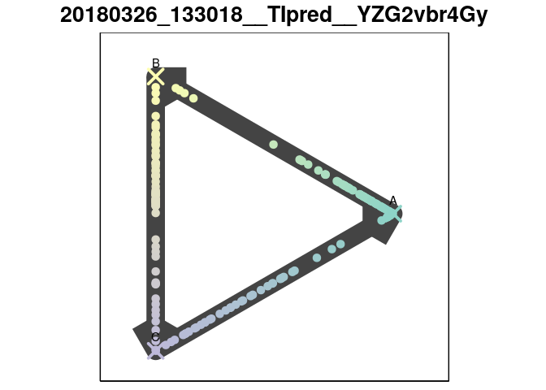
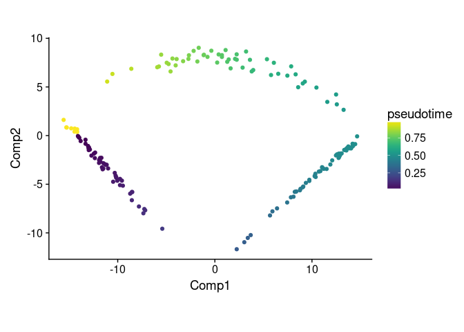
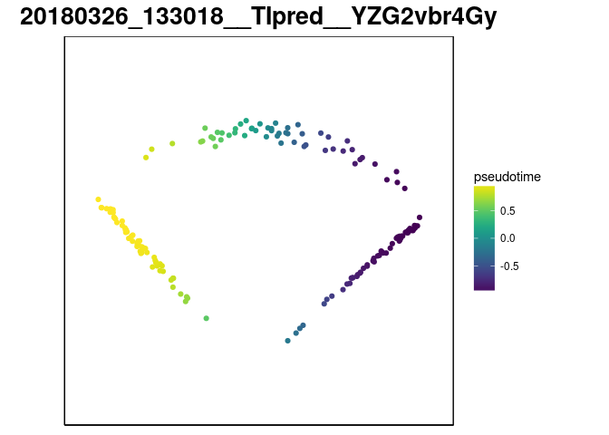

Arc-tangent
================
2018-03-26

This document serves to provide insight into how a trajectory inference method was used and wrapped. Feel free to discuss implementation-specific details by [creating an issue](https://github.com/dynverse/dynmethods/issues) on GitHub, or improve the wrapper and create a pull request.

``` r
library(tidyverse)
library(dynmethods)
library(dynwrap)
library(dynutils)
library(dynplot)
```

Description
===========

This is a control method for inferring cyclic trajectories in a very simple approach, consisting of a dimensionality reduction step and followed by calculating the arc-tangent between the first and the second component.

The wrapper can be accessed using the `description_atan` function.

``` r
method <- description_atan()
```

This description contains information on which packages need to have been installed in order to run the method and what are the parameters.

``` r
str(method, max.level = 1)
```

    ## List of 8
    ##  $ name            : chr "Arc-tangent"
    ##  $ short_name      : chr "atan"
    ##  $ package_loaded  : NULL
    ##  $ package_required: NULL
    ##  $ par_set         :List of 2
    ##   ..- attr(*, "class")= chr "ParamSet"
    ##  $ properties      : NULL
    ##  $ run_fun         :function (expression, dimred = "pca")  
    ##  $ plot_fun        :function (prediction)  
    ##   ..- attr(*, "srcref")=Class 'srcref'  atomic [1:8] 46 14 52 1 14 1 377 383
    ##   .. .. ..- attr(*, "srcfile")=Classes 'srcfilealias', 'srcfile' <environment: 0x92ef130> 
    ##  - attr(*, "class")= chr [1:2] "dynmethod::description" "list"

``` r
method$par_set
```

    ##            Type len Def               Constr Req Tunable Trafo
    ## dimred discrete   - pca pca,mds,tsne,ica,lle   -    TRUE     -

Example
=======

First we retrieve a toy dataset from [http://github.com/dynverse/dyntoy](dyntoy).

``` r
toy_tasks <- dyntoy::toy_tasks %>% 
  filter(model == "cycle") %>% 
  slice(2)
toy_task <- toy_tasks %>% extract_row_to_list(1)

plot_default(toy_task)
```


We extract the default parameters from the method.

``` r
defprm <- get_default_parameters(method)
```

Applying the method on the toy dataset can be performed using the `execute_method` function.

``` r
out <- execute_method(toy_tasks, method, parameters = defprm)[[1]]
```

The output will consist of a summary and the model. The summary will contain information pertaining the execution of the method, while the model will contain the trajectory inferred by the method.

``` r
out$summary %>% knitr::kable()
```

| method\_name | method\_short\_name | task\_id     |  time\_sessionsetup|  time\_preprocessing|  time\_method|  time\_postprocessing|  time\_wrapping|  time\_sessioncleanup| error |  num\_files\_created|  num\_setseed\_calls| prior\_df                                                   |
|:-------------|:--------------------|:-------------|-------------------:|--------------------:|-------------:|---------------------:|---------------:|---------------------:|:------|--------------------:|--------------------:|:------------------------------------------------------------|
| Arc-tangent  | atan                | toy/cycle\_2 |           0.0132666|             3.65e-05|      0.003264|             0.1931798|       0.0001848|             0.0005691| NULL  |                    0|                    0| list(prior\_type = logical(0), prior\_names = character(0)) |

``` r
model <- out$model 

plot_default(model)
```



``` r
plot_trajectory(model, method)
```


Wrapper implementation
======================

This section will detail the specific wrapper implementation by applying it on the toy dataset, and should follow the same implementation structure as the [https://github.com/dynverse/dynmethods/blob/master/R/ti\_atan.R](source%20code).

In the first step, a dimensionality reduction to two dimensions is computed. By default, this is PCA. Here, it is assumed that the dimensionality reduction will be centered around the origin 0.

``` r
expression <- toy_task$expression
dimred <- dynmethods:::dimred(expression, method = defprm$dimred, ndim = 2)

# Plot dimred
dimred_df <- data.frame(dimred) %>% rownames_to_column("cell_id")
ggplot(dimred_df) + 
  geom_point(aes(Comp1, Comp2)) + 
  coord_equal() +
  cowplot::theme_cowplot()
```


The ordering of the cells is computed by calculating the bearing of each cell with respect to the origin. The bearing is transformed to a \[0,1\] range.

``` r
pseudotimes <- atan2(dimred[,2], dimred[,1]) / 2 / pi + .5

dimred_df <- dimred_df %>% mutate(pseudotime = pseudotimes[cell_id])
ggplot(dimred_df) +
  geom_point(aes(Comp1, Comp2, colour = pseudotime)) +
  coord_equal() + 
  viridis::scale_color_viridis() +
  cowplot::theme_cowplot()
```



The prediction is wrapped using the `add_cycling_trajectory_to_wrapper` function.

``` r
prediction <- wrap_prediction_model(
  cell_ids = rownames(expression)
) %>% add_cyclic_trajectory_to_wrapper(
  pseudotimes = pseudotimes,
  do_scale_minmax = FALSE
) %>% add_dimred_to_wrapper(
  dimred = dimred
)

plot_default(prediction)
```


``` r
plot_trajectory(model, method)
```



Quality control
===============

None, since this is a control method.
